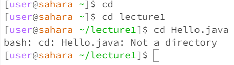
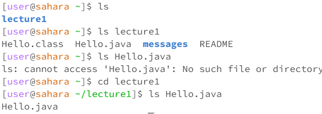
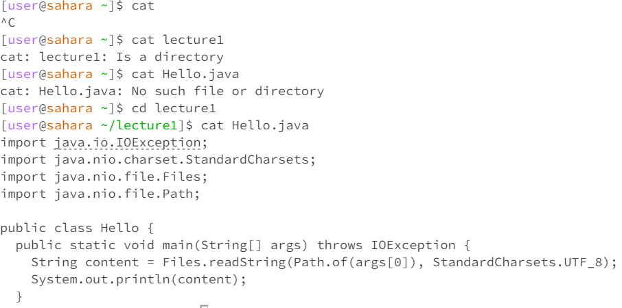

# Lab Report 1

SCORE:

What the working directory was when the command was run

- `/home` is the working directory when the command was run before using the `cd` command. Then when I `cd lecture1` folder. The working directory is now `lecture1`. When I try to `cd Hello.java`, it's still in the `lecture1` directory.

A sentence or two explaining why you got that output (e.g. what was in the filesystem, what it meant to have no arguments).

- I got the argument to be `lecture1` and it's now the working directory. Without the argument, the default would be at the home directory. 

Indicate whether the output is an error or not, and if it’s an error, explain why it’s an error.

-The output of the code when I simply `cd` doesn’t give an error since cd by default is a home directory which could be explained by the “~”. The next case with it being `cd lecture1`, It doesn’t give an error at all and it simply just updates the directory to the “lecture1”. In the final case when I `cd Hello.java`, it states that `Hello.java` is “Not a directory”. The reason why it's an error is because Hello.java is simply a Java file and not a folder to which we can set the directory. This is why it gives this output. 

SCORE:

What the working directory was when the command was run
- The working directory is /home when the command was running in the `ls` command.

A sentence or two explaining why you got that output (e.g. what was in the filesystem, what it meant to have no arguments).
-No arguments simply read all the files that were in the folder. The `ls` command simply finds the files contained in the system. When I `ls` the directory to `lecture1`. It simply prints out the contents contained inside the lecture1 directory with it containing both the files and the messages directory highlighted in blue. When I `ls` the file Hello.java, it gives a message saying “No such file or directory” on the home directory. 

Indicate whether the output is an error or not, and if it’s an error, explain why it’s an error.
- In the case of simply `ls`, there are no errors and it simply prints out the directory which is lecture1. When I `ls lecture1` for example, I get the list of contents that is contained within the lecture1 directory and the output gives no error. However, when I try to still `ls Hello.java`, it still gives an error that says “No such file or directory”. But if I `cd` to lecture1 as a working directory, it will then print out the file name of Hello.java.
  

SCORE:

What the working directory was when the command was run
- `/home` is the working directory that the command was running on.
  
A sentence or two explaining why you got that output (e.g. what was in the filesystem, what it meant to have no arguments).
- I noticed that when I try to `cat` without arguments, it does show that it's trying to look for what can `cat` but is unable to find any sort of file and just instead prints a blank line until it can be able to find more information but without any arguments, it will not know which one to find it so I had to end it with a Ctrl+C. There are no error messages in the file system but the terminal is just sitting there expecting something on our end to print out the message. 

Indicate whether the output is an error or not, and if it’s an error, explain why it’s an error.
- When I simply entered `cat`, there was no error message but a blank line. When I `cat lecture1`, it simply states the lecture1: is a directory to explain the path and where it at. Finally, when I tried to `cat Hello.java` in the home directory, it simply said “No such file or directory” which is an error message. But when I `cd lecture1` and then `cat Hello.java`. It prints the file contents of what Hello.java contains inside. This is the output that I noticed within these three cases.  

link: https://paulr2023.github.io/cse15l-lab-reports/lab1.html
