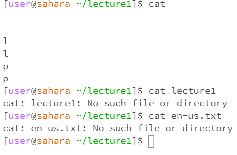

# Hello, World 

What the working directory was when the command was run
- lecture1 is the working directory when the command was run using the cd 

A sentence or two explaining why you got that output (e.g. what was in the filesystem, what it meant to have no arguments).
- With no arguments, the command couldn't find where the file is if we didn't state the location. The file system cannot find the directory if we just say the output. 

Indicate whether the output is an error or not, and if it’s an error, explain why it’s an error.
- It's an error because it states that there's "No such file or directory" meaning that it can't be able to find or bring the file in.

What the working directory was when the command was run
- The working directory is lecture1 when the command was running in the ls command.

A sentence or two explaining why you got that output (e.g. what was in the filesystem, what it meant to have no arguments).
- No arguments simply reads all the files that were in the folder. The ls command simply finds the files contained in the system. 

Indicate whether the output is an error or not, and if it’s an error, explain why it’s an error.
- The output is an error because it is not able to find the files listed since the ls command lists all of the files but is unable to output one when typing the ls command to try to get that hello.java file. 
  

What the working directory was when the command was run
- Lecture1 is the working directory that the command was running on.
  
A sentence or two explaining why you got that output (e.g. what was in the filesystem, what it meant to have no arguments).
- The reason why I got the output of cat without arguments is that its waiting and is unable to find a file to cat with. The file system is there but without the cat with an argument, its unable to find the output and connect together. 

Indicate whether the output is an error or not, and if it’s an error, explain why it’s an error.
- 
