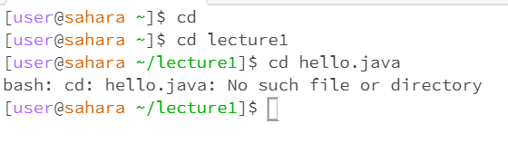

# Hello, World 

What the working directory was when the command was run
- /home is the working directory when the command was run before using the cd command.

A sentence or two explaining why you got that output (e.g. what was in the filesystem, what it meant to have no arguments).
- I got the argument to be lecture1 and it's now the working directory. Without the argument, the default would be at the home directory. 

Indicate whether the output is an error or not, and if it’s an error, explain why it’s an error.
- It's an error because it states that there's "No such file or directory" meaning that it can't be able to find or bring the file in.

What the working directory was when the command was run
- The working directory is /home when the command was running in the ls command.

A sentence or two explaining why you got that output (e.g. what was in the filesystem, what it meant to have no arguments).
- No arguments simply reads all the files that were in the folder. The ls command simply finds the files contained in the system. 

Indicate whether the output is an error or not, and if it’s an error, explain why it’s an error.
- The output is an error because it is not able to find the files listed since the ls command can't access hello.java since it has to reach the directory of lecture1 first before continuing on the path to hello.java. 
  

What the working directory was when the command was run
- /home is the working directory that the command was running on.
  
A sentence or two explaining why you got that output (e.g. what was in the filesystem, what it meant to have no arguments).
- The reason why I got the output of cat without arguments is that it knows that it found the lecture1 being a directory. The file system is there but without the cat with an argument, its unable to find the output and connect together. 

Indicate whether the output is an error or not, and if it’s an error, explain why it’s an error.
- THe output when inputting cat en-us.txt is an error because its unable to find the txt file since it was unable to go past the lecture1 directory. 
