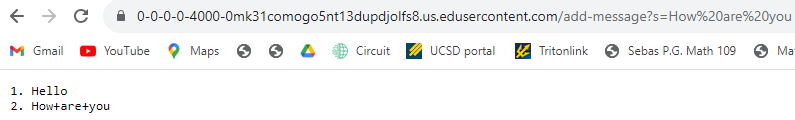

# Lab Report 2

```
import java.io.IOException;

import java.net.URI;

class Handler implements URLHandler {

    // The one bit of state on the server: a number that will be manipulated by
    // various requests.
    int num = 1;

    String newWord = "";
    String line = "";
   
    public String handleRequest(URI url) {
        System.out.println(url);
        if (url.getPath().equals("/")) {
            return String.format("Number: %d", num);

        } else if (url.getPath().equals("/increment\n")) {
            num += 1;
            return String.format("Number incremented!");

        } else {
            if (url.getPath().contains("/add-message")) {
                String[] parameters = url.getQuery().split("=");

            if ( parameters[0].equals("s")) {
                String value = parameters[1];

            // Construct the new line with the sequence number, value, and new line character
            line = String.format(" %d. %s\n", num++, value);

            // Append the line to the running string
            // Respond with the entire running string
            return newWord += line;
                    
                }
            }
            return "404 Not Found!";
        }
    }
}

class NumberServer {
    public static void main(String[] args) throws IOException {
        if(args.length == 0){
            System.out.println("Missing port number! Try any number between 1024 to 49151");
            return;`
        }

        int port = Integer.parseInt(args[0]);

        Server.start(port, new Handler());
    }
}
```
---


# Which methods in your code are called?

The method being called is the `public String handleRequest(URI URL)` method which will go through the else statement to see if the conditions of having the `add-message?s=<string>` which will print it out in the Server website with what is going to be printed with the string. 

# What are the relevant arguments to those methods, and the values of any relevant fields of the class?
   
The relevant arguments with these methods are URL url which will go through the if-else statement on the `String[] parameters` if there contains a = sign in the url and will then return the String.format which contains the arguments of num and value based on String typed with this command `/add-message?s=Hello`.
    
# How do the values of any relevant fields of the class change from this specific request? If no values got changed, explain why.
  
The values of the fields that get changed are when I add a string saying hello. It brought changes to the request with the `String.format` which will update the String based on this request. 

--- 



# Which methods in your code are called?

The method being called is the public String handleRequest(URI URL) method which will go through the else statement to see if the conditions of having the add-message?s=<How are you> which will print it out in the Server website with what is going to be printed with the string How are you. It was similar to the last question except I added a new word in the String to be able to add another string and increment it.  

# What are the relevant arguments to those methods, and the values of any relevant fields of the class?

The relevant arguments with these methods are the String value that will print from the function of String. The relevant arguments with these methods are URL url which will go through the if-else statement on the String[] parameters if there contains a = sign in the url and will then return the String.format which contains the arguments of num and value based on String typed with this command `/add-message?s=Hello` and goes through an extra step of going thru `newWord += line` which will print another string on top of the existing string.

# How do the values of any relevant fields of the class change from this specific request? If no values got changed, explain why.

The way the fields of the class changed from this request was by how it was changed in the fields based on the argument that we provide on the String. After I inputted "Hello" to the web server. It updates the field in the String.format and changes the value. Then afterward, adding the argument, "How are you" would update the field of the newWord, therefore, it will print a new line with the string. 

---
    
- The path to the private key for your SSH key for logging into ieng6 (on your computer or on the home directory of the lab computer)


- The path to the public key for your SSH key for logging into ieng6 (within your account on ieng6)


- A terminal interaction where you log into ieng6 with your course-specific account without being asked for a password.


---

# In a couple of sentences, describe something you learned from lab in week 2 or 3 that you didn’t know before.
The things I learned in week 2 or 3 that I didn’t know before are running the web servers and logging into the ssh keys since they’re pretty helpful to be able to log in without having to enter the password to connect to the server. I learned a bit about how the web servers connect and how you can be able to modify the Google page. This lesson is interesting and useful for the future which is good that I got to get a preview of what's to come next.  
