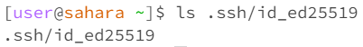
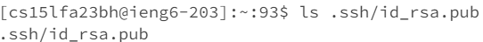
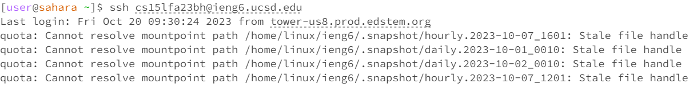

`import java.io.IOException;`
`import java.net.URI;`

`class Handler implements URLHandler {`
    `// The one bit of state on the server: a number that will be manipulated by`
   ` // various requests.`
    int num = 1;

    String newWord = "";
    String line = "";
   
    public String handleRequest(URI url) {
        System.out.println(url);
        if (url.getPath().equals("/")) {
            return String.format("Number: %d", num);

        } else if (url.getPath().equals("/increment\n")) {
            num += 1;
            return String.format("Number incremented!");

        } else {
            if (url.getPath().contains("/add-message")) {
                String[] parameters = url.getQuery().split("=");

            if ( parameters[0].equals("s")) {
                String value = parameters[1];

            // Construct the new line with the sequence number, value, and new line character
            line = String.format(" %d. %s\n", num++, value);

            // Append the line to the running string
            // Respond with the entire running string
            return newWord += line;
                    
                }
            }
            return "404 Not Found!";
        }
    }
}

class NumberServer {
    public static void main(String[] args) throws IOException {
        if(args.length == 0){
            System.out.println("Missing port number! Try any number between 1024 to 49151");
            return;
        }

        int port = Integer.parseInt(args[0]);

        Server.start(port, new Handler());
    }
}`

Which methods in your code are called?

-The method being called is the public String handleRequest(URI URL)

What are the relevant arguments to those methods, and the values of any relevant fields of the class?
-The relevant arguments with these methods are URL

How do the values of any relevant fields of the class change from this specific request? If no values got changed, explain why.

Which methods in your code are called?

-The method being called is the public String handleRequest(URI URL)

What are the relevant arguments to those methods, and the values of any relevant fields of the class?

-The relevant argument within these methods are

-The relevant arguments with these methods are the String value that will print from the function of S

-How do the values of any relevant fields of the class change from this specific request? If no values got changed, explain why.

- The path to the private key for your SSH key for logging into ieng6 (on your computer or on the home directory of the lab computer)

- The path to the public key for your SSH key for logging into ieng6 (within your account on ieng6)

- A terminal interaction where you log into ieng6 with your course-specific account without being asked for a password.

In a couple of sentences, describe something you learned from lab in week 2 or 3 that you didn’t know before.
- The things I learned in week 2 or 3 that I didn’t know before are running the web servers and logging into the ssh keys since they’re pretty helpful and I learned a bit from how the web servers connect and how you can be able to modify the Google page. Since I’m a transfer student, this lesson is interesting and useful for the future which is good that I got base in.  
