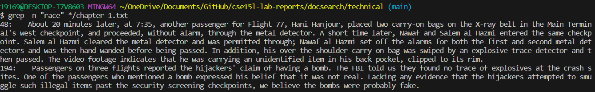
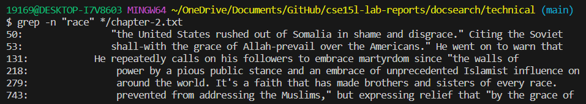
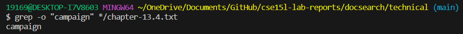
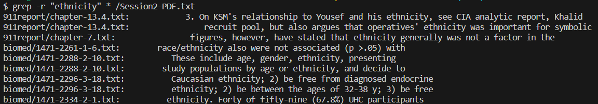
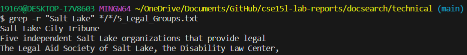
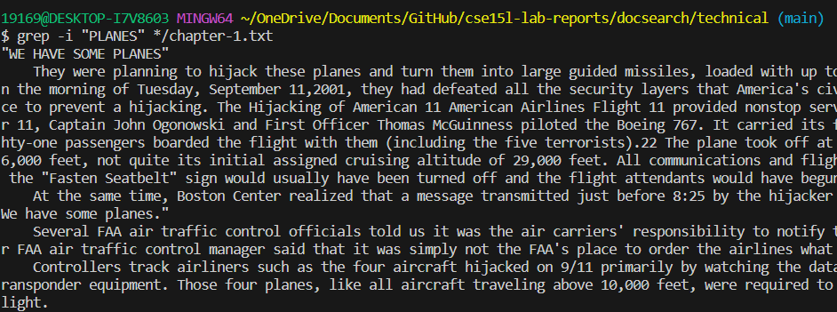
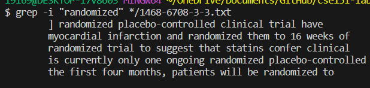

Part 1 - Bugs
Choose one of the bugs from lab 4.

Provide:

A failure-inducing input for the buggy program, as a JUnit test and any associated code (write it as a code block in Markdown)

```
# public class ArrayTests {
	@Test 
	public void testReverseInPlace() {
    int[] input1 = { 3 };
    ArrayExamples.reverseInPlace(input1);
    assertArrayEquals(new int[]{ 3 }, input1);
	}
# @Test
  public void testReversed() {
    int[] input1 = { };
    assertArrayEquals(new int[]{ }, ArrayExamples.reversed(input1));
  }
}
```

An input that doesn’t induce a failure, as a JUnit test and any associated code (write it as a code block in Markdown)

```
JUnit version 4.13.2

Time: 0.037

OK (2 tests)

```
```
import static org.junit.Assert.*;
import org.junit.*;

public class ArrayTests {
	@Test 
	public void testReverseInPlace() {
    int[] input1 = {3, 5, 8};
    ArrayExamples.reverseInPlace(input1);
    assertArrayEquals(new int[]{8, 5, 3}, input1);
	}


  @Test
  public void testReversed() {
    int[] input1 = {2, 4};
    assertArrayEquals(new int[]{4, 2}, ArrayExamples.reversed(input1));
  }
}
```

The symptom, as the output of running the tests (provide it as a screenshot of running JUnit with at least the two inputs above)


The bug, as the before-and-after code change required to fix it (as two code blocks in Markdown)


Briefly describe why the fix addresses the issue.


Consider the commands less, find, and grep. Choose one of them. Online, find 4 interesting command-line options or alternate ways to use the command you chose. To find information about the commands, a simple Web search like “find command-line options” will probably give decent results. There is also a built-in command on many systems called man (short for “manual”) that displays information about commands; you can use man grep, for example, to see a long listing of information about how grep works. Also consider asking ChatGPT!

For example, we saw the -name option for find in class. For each of those options, give 2 examples of using it on files and directories from ./technical. Show each example as a code block that shows the command and its output, and write a sentence or two about what it’s doing and why it’s useful.

That makes 8 total examples, all focused on a single command. There should be two examples each for four different command-line options. Many commands like these have pretty sophisticated behavior possible – it can take years to be exposed to and learn all of the possible tricks and inner workings.




-The -i command would be able to print the output of the passage. The reason why it could be useful is if we want to find a exerpt or a text. We an be able to find the keyword with the "" and be able to print the exerpt that contains the word and the string of it to where this could be useful in finding the file associated with the text and show the results. 




-The -o command would be able to print out the case if it finds the string that's contained in the txt file. Its useful to find if the keyword is contained within the file and if it find the file. It will print the result in the terminal to show that the word is contained in the txt file. 




-The -r command would be able to print out the the directory that's here and the associated txt files that's will print from here. Its useful when we're trying to find the location of the the string by printing out the path to the directory.




-The -i command would be able to print the output of the passage. The reason why it could be useful is if we want to find a exerpt or a text. We an be able to find the keyword with the "" and be able to print the exerpt that contains the word and the string.

Along with each option/mode you show, cite your source for how you found out about it as a URL or a description of where you found it. See the syllabus on Academic Integrity and how to cite sources like ChatGPT for this class.

Pompt I gave to ChatGPT: 4 interesting command line options for grep

The output of the response simply gave 4 different options
