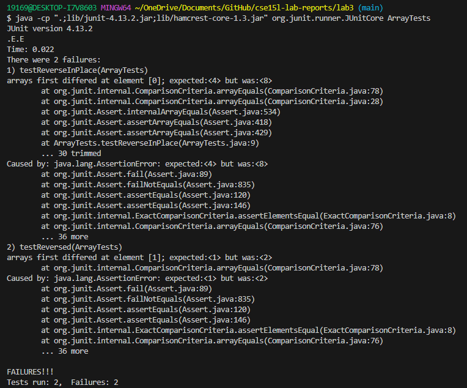
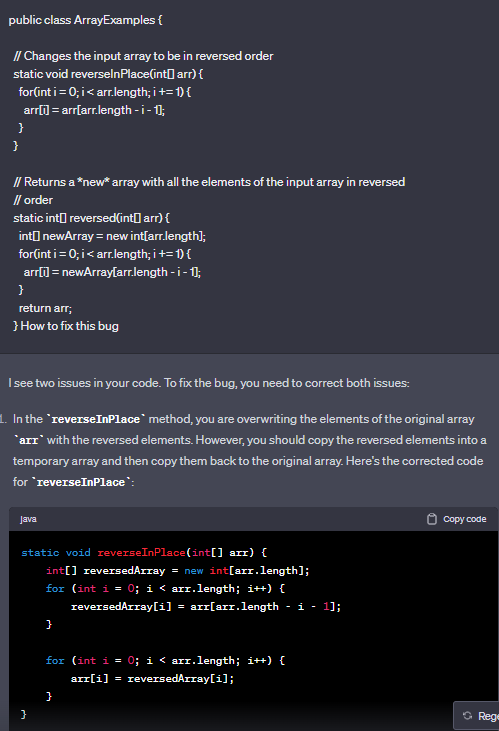

Part 1 - Bugs
Choose one of the bugs from lab 4.

Provide:

# A failure-inducing input for the buggy program, as a JUnit test and any associated code (write it as a code block in Markdown)

```
import static org.junit.Assert.*;
import org.junit.*;

public class ArrayTests {
	@Test 
	public void testReverseInPlace() {
    int[] input1 = {3, 5, 8};
    ArrayExamples.reverseInPlace(input1);
    assertArrayEquals(new int[]{4, 8, 3}, input1);
	}


  @Test
  public void testReversed() {
    int[] input1 = {2, 4};
    assertArrayEquals(new int[]{4, 1}, ArrayExamples.reversed(input1));
  }
}

 # This is the failed test 
JUnit version 4.13.2
.E.E
Time: 0.016
There were 2 failures:
```
# An input that doesn’t induce a failure, as a JUnit test and any associated code (write it as a code block in Markdown)
feedback: Missing non-failure inducing test
My response 
```
import static org.junit.Assert.*;
import org.junit.*;

public class ArrayTests {
	@Test 
	public void testReverseInPlace() {
    int[] input1 = {1};
    ArrayExamples.reverseInPlace(input1);
    assertArrayEquals(new int[]{1}, input1);
	}


  @Test
  public void testReversed() {
    int[] input1 = {0};
    assertArrayEquals(new int[]{0}, ArrayExamples.reversed(input1));
  }
}

$ java -cp ".;lib/junit-4.13.2.jar;lib/hamcrest-core-1.3.jar" org.junit.runner.JUnitCore ArrayTests
JUnit version 4.13.2
..
Time: 0.023

OK (2 tests)
```

# The symptom, as the output of running the tests (provide it as a screenshot of running JUnit with at least the two inputs above)


# The bug, as the before-and-after code change required to fix it (as two code blocks in Markdown)
The code with the bugs 
```
public class ArrayExamples {

  // Changes the input array to be in reversed order
  static void reverseInPlace(int[] arr) {
    for(int i = 0; i < arr.length; i += 1) {
      arr[i] = arr[arr.length - i - 1];
    }
  }

  // Returns a *new* array with all the elements of the input array in reversed
  // order
  static int[] reversed(int[] arr) {
    int[] newArray = new int[arr.length];
    for(int i = 0; i < arr.length; i += 1) {
      arr[i] = newArray[arr.length - i - 1];
    }
    return arr;
  }
```
The code with bugs fixed 
```
public class ArrayExamples {
 
  // Changes the input array to be in reversed order
  static void reverseInPlace(int[] arr) {
    int[] k = new int[arr.length];

    for (int i = 0; i < arr.length; i++) {
        k[i] = arr[arr.length - i - 1];
        arr[i] = k[i];
    }

  }

  // Returns a *new* array with all the elements of the input array in reversed
  // order 
  static int[] reversed(int[] arr) {
    int[] newArray = new int[arr.length];
    for(int i = 0; i < arr.length; i++) {
      newArray[i] = arr[arr.length - i - 1];
    }
    return newArray;
  }
```

# Briefly describe why the fix addresses the issue.
The reason why the fixes addressed the issue is that with another for statement. It can try to search for the conditions to where it will check to see if the cases are right. It double-checks the cases to make sure its able to verify if the reverse of the array has passed. This is why adding this block of code below is very helpful it can copy the elements from the k back to arr to make sure it's equal to the case and will then copy elements to verify.  

 ```   // It will try to copy the elements from k back to arr.
        arr[i] = k[i];
```
Prompt I gave to ChatGPT: 

- The way I changed the output was that I simply removed the unnecessary for satement that was repeating as the conditions are already the same as the one above. It could be a way to double-check to make sure the condition is true but once the condition passes through. It should be more than sufficient to run arr[i] = k[i]

#Part 1 SCORE:

Consider the commands less, find, and grep. Choose one of them. Online, find 4 interesting command-line options or alternate ways to use the command you chose. To find information about the commands, a simple Web search like “find command-line options” will probably give decent results. There is also a built-in command on many systems called man (short for “manual”) that displays information about commands; you can use man grep, for example, to see a long listing of information about how grep works. Also consider asking ChatGPT!

For example, we saw the -name option for find in class. For each of those options, give 2 examples of using it on files and directories from ./technical. Show each example as a code block that shows the command and its output, and write a sentence or two about what it’s doing and why it’s useful.

That makes 8 total examples, all focused on a single command. There should be two examples each for four different command-line options. Many commands like these have pretty sophisticated behavior possible – it can take years to be exposed to and learn all of the possible tricks and inner workings.

feedback: For each command you run (8), please include a description of what exactly the command is doing and how it can be useful.
My response: 

```
$ grep -i "PLANES" */chapter-1.txt

"WE HAVE SOME PLANES"
    They were planning to hijack these planes and turn them into large guided missiles, loaded with up to 11,400 gallons of jet fuel. By 8:00 A.M. on the morning of Tuesday, September 11,2001, they had defeated all the security layers that America's civil aviation security system then had in place to prevent a hijacking. The Hijacking of American 11 American Airlines Flight 11 provided nonstop service from Boston to Los Angeles. On September 11, Captain John Ogonowski and First Officer Thomas McGuinness piloted the Boeing 767. It carried its full capacity of nine flight attendants. Eighty-one passengers boarded the flight with them (including the five terrorists).22 The plane took off at 7:59. Just before 8:14, it had climbed to 26,000 feet, not quite its initial assigned cruising altitude of 29,000 feet. All communications and flight profile data were normal. About this time the "Fasten Seatbelt" sign would usually have been turned off and the flight attendants would have begun preparing for cabin service.
```

```
$ grep -i "randomized" */1468-6708-3-3.txt

        ] randomized placebo-controlled clinical trial have  
        myocardial infarction and randomized them to 16 weeks of
        randomized trial to suggest that statins confer clinical
        is currently only one ongoing randomized placebo-controlled
        the first four months, patients will be randomized to

```
-The `grep -i` command would be able to print the output of the passage. The reason why it could be useful is if we want to find an exerpt or a text. We a be able to find the keyword with the "" and be able to print the excerpt that contains the word and the string of it to where this could be useful in finding the file associated with the text and showing the results. 

```
$ grep -o "campaign" */chapter-13.4.txt
campaign
```
```
$ grep -o "concerning" */*/Progress_report.txt
concerning
```

-The `grep -o` command would be able to print out the case if it finds the string that's contained in the txt file. It's useful to find if the keyword is contained within the file and if it finds the file. It will print the result in the terminal to show that the word is contained in the .txt file. 

```
$ grep -r "ethnicity" * /Sessions2-PDF.txt
911report/chapter-13.4.txt:            3. On KSM's relationship to Yousef and his ethnicity, see CIA analytic report, Khalid
911report/chapter-13.4.txt:                recruit pool, but also argues that operatives' ethnicity was important for symbolic
911report/chapter-7.txt:                figures, however, have stated that ethnicity generally was not a factor in the    
biomed/1471-2261-1-6.txt:        race/ethnicity also were not associated (p >.05) with
biomed/1471-2288-2-10.txt:          These include age, gender, ethnicity, presenting
biomed/1471-2288-2-10.txt:        study populations by age or ethnicity, and decide to
biomed/1471-2296-3-18.txt:          Caucasian ethnicity; 2) be free from diagnosed endocrine
biomed/1471-2296-3-18.txt:          ethnicity; 2) be between the ages of 32-38 y; 3) be free
biomed/1471-2334-2-1.txt:          ethnicity. Forty of fifty-nine (67.8%) UHC participants
biomed/1471-2377-3-4.txt:            race/ethnicity.
```

```
$ grep -r "Salt Lake" */*/5_Legal_Groups.txt
Salt Lake City Tribune
Five independent Salt Lake organizations that provide legal
The Legal Aid Society of Salt Lake, the Disability Law Center,
````

-The `grep -r` command would be able to print out the directory that's here and the associated txt files that will print from here. It's useful when we're trying to find the location of the string by printing out the path to the directory.

```
$ grep -n "race" */chapter-2.txt
50:                "the United States rushed out of Somalia in shame and disgrace." Citing the Soviet
53:                shall-with the grace of Allah-prevail over the Americans." He went on to warn that
131:            He repeatedly calls on his followers to embrace martyrdom since "the walls of
218:                power by a pious public stance and an embrace of unprecedented Islamist influence on
279:                around the world. It's a faith that has made brothers and sisters of every race.
743:                prevented from addressing the Muslims," but expressing relief that "by the grace of
```

```
$ grep -n "race" */chapter-2.txt
50:                "the United States rushed out of Somalia in shame and disgrace." Citing the Soviet
53:                shall-with the grace of Allah-prevail over the Americans." He went on to warn that
131:            He repeatedly calls on his followers to embrace martyrdom since "the walls of
218:                power by a pious public stance and an embrace of unprecedented Islamist influence on
279:                around the world. It's a faith that has made brothers and sisters of every race.
743:                prevented from addressing the Muslims," but expressing relief that "by the grace of
```

-The `grep -n` command would be able to print the output of the passage. The reason why it could be useful is if we want to find a text. We can find the keyword with the "" and be able to print the excerpt that contains the word and the string.

Along with each option/mode you show, cite your source for how you found out about it as a URL or a description of where you found it. See the syllabus on Academic Integrity and how to cite sources like ChatGPT for this class.

---
Pompt I gave to ChatGPT: 4 interesting command line options for grep

The output of the response simply gave 4 different options listing the examples of grep -n, grep -o, grep -i, and grep -r. The way I changed the output after it was produced is by using these templates as a guide to be able to use the grep commands and gain a better understanding as to how it works and I applied it to our lab.

![Image] (grep help 1.png)
![Image] (grep help 2.png)

#Part 2 score:
