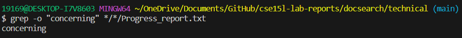

Part 1 - Bugs
Choose one of the bugs from lab 4.

Provide:

# A failure-inducing input for the buggy program, as a JUnit test and any associated code (write it as a code block in Markdown)

``` # This is the code
import static org.junit.Assert.*;
import org.junit.*;

public class ArrayTests {
	@Test 
	public void testReverseInPlace() {
    int[] input1 = {3, 5, 8};
    ArrayExamples.reverseInPlace(input1);
    assertArrayEquals(new int[]{4, 8, 3}, input1);
	}


  @Test
  public void testReversed() {
    int[] input1 = {2, 4};
    assertArrayEquals(new int[]{4, 1}, ArrayExamples.reversed(input1));
  }
}

``` # This is the failed test 
JUnit version 4.13.2
.E.E
Time: 0.016
There were 2 failures:
```
# An input that doesn’t induce a failure, as a JUnit test and any associated code (write it as a code block in Markdown)

```
JUnit version 4.13.2

Time: 0.037

OK (2 tests)

```
```
import static org.junit.Assert.*;
import org.junit.*;

public class ArrayTests {
	@Test 
	public void testReverseInPlace() {
    int[] input1 = {3, 5, 8};
    ArrayExamples.reverseInPlace(input1);
    assertArrayEquals(new int[]{8, 5, 3}, input1);
	}


  @Test
  public void testReversed() {
    int[] input1 = {2, 4};
    assertArrayEquals(new int[]{4, 2}, ArrayExamples.reversed(input1));
  }
}
```

# The symptom, as the output of running the tests (provide it as a screenshot of running JUnit with at least the two inputs above)


# The bug, as the before-and-after code change required to fix it (as two code blocks in Markdown)
The code with the bugs 
```
public class ArrayExamples {

  // Changes the input array to be in reversed order
  static void reverseInPlace(int[] arr) {
    for(int i = 0; i < arr.length; i += 1) {
      arr[i] = arr[arr.length - i - 1];
    }
  }

  // Returns a *new* array with all the elements of the input array in reversed
  // order
  static int[] reversed(int[] arr) {
    int[] newArray = new int[arr.length];
    for(int i = 0; i < arr.length; i += 1) {
      arr[i] = newArray[arr.length - i - 1];
    }
    return arr;
  }
```
The code with bugs fixed 
```
public class ArrayExamples {
 
  // Changes the input array to be in reversed order
  static void reverseInPlace(int[] arr) {
    int[] k = new int[arr.length];

    for (int i = 0; i < arr.length; i++) {
        k[i] = arr[arr.length - i - 1];
        arr[i] = k[i];
    }

  }

  // Returns a *new* array with all the elements of the input array in reversed
  // order 
  static int[] reversed(int[] arr) {
    int[] newArray = new int[arr.length];
    for(int i = 0; i < arr.length; i++) {
      newArray[i] = arr[arr.length - i - 1];
    }
    return newArray;
  }
```

# Briefly describe why the fix addresses the issue.
The reason why the fixes addressed the issue is that with another for statement. It can try to search for the conditions to where it will check to see if the cases are right. It double-checks the cases to make sure its able to verify if the reverse of the array has passed. This is why adding this block of code below is very helpful it can copy the elements from the k back to arr to make sure it's equal to the case and will then copy elements to verify.  

 ```   // It will try to copy the elements from k back to arr.
        arr[i] = k[i];
```
Prompt I gave to ChatGPT: 

- The way I changed the output was that I simply removed the unnecessary for satement that was repeating as the conditions are already the same as the one above. It could be a way to double-check to make sure the condition is true but once the condition passes through. It should be more than sufficient to run arr[i] = k[i]

#Part 1 SCORE:

# Consider the commands less, find, and grep. Choose one of them. Online, find 4 interesting command-line options or alternate ways to use the command you chose. To find information about the commands, a simple Web search like “find command-line options” will probably give decent results. There is also a built-in command on many systems called man (short for “manual”) that displays information about commands; you can use man grep, for example, to see a long listing of information about how grep works. Also consider asking ChatGPT!

# For example, we saw the -name option for find in class. For each of those options, give 2 examples of using it on files and directories from ./technical. Show each example as a code block that shows the command and its output, and write a sentence or two about what it’s doing and why it’s useful.

# That makes 8 total examples, all focused on a single command. There should be two examples each for four different command-line options. Many commands like these have pretty sophisticated behavior possible – it can take years to be exposed to and learn all of the possible tricks and inner workings.


-The `grep -i` command would be able to print the output of the passage. The reason why it could be useful is if we want to find an exerpt or a text. We a be able to find the keyword with the "" and be able to print the excerpt that contains the word and the string of it to where this could be useful in finding the file associated with the text and showing the results. 




-The `grep -o` command would be able to print out the case if it finds the string that's contained in the txt file. It's useful to find if the keyword is contained within the file and if it finds the file. It will print the result in the terminal to show that the word is contained in the .txt file. 


-The `grep -r` command would be able to print out the directory that's here and the associated txt files that will print from here. It's useful when we're trying to find the location of the string by printing out the path to the directory.


-The `grep -i` command would be able to print the output of the passage. The reason why it could be useful is if we want to find a text. We can find the keyword with the "" and be able to print the excerpt that contains the word and the string.

Along with each option/mode you show, cite your source for how you found out about it as a URL or a description of where you found it. See the syllabus on Academic Integrity and how to cite sources like ChatGPT for this class.

---
Pompt I gave to ChatGPT: 4 interesting command line options for grep

The output of the response simply gave 4 different options listing the examples of grep -n, grep -o, grep -i, and grep -r. The way I changed the output after it was produced is by using these templates as a guide to be able to use the grep commands and gain a better understanding as to how it works and I applied it to our lab.

#Part 2 score:
